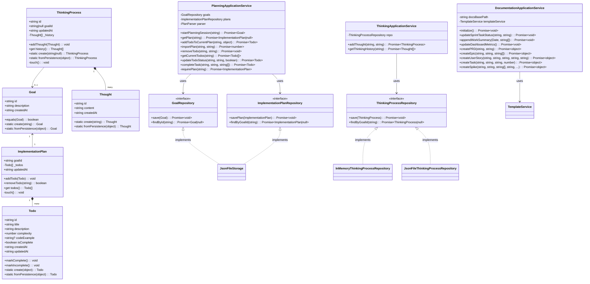

# Software Planning Tool Architecture

## Class Diagram

```mermaid
classDiagram
    %% Domain Entities
    class Goal {
        +string id
        +string description
        +string createdAt
        +equals(Goal): boolean
        +static create(string): Goal
        +static fromPersistence(object): Goal
    }
    
    class Todo {
        +string id
        +string title
        +string description
        +number complexity
        +string? codeExample
        +boolean isComplete
        +string createdAt
        +string updatedAt
        +markComplete(): void
        +markIncomplete(): void
        +static create(object): Todo
        +static fromPersistence(object): Todo
    }
    
    class Thought {
        +string id
        +string content
        +string createdAt
        +static create(string): Thought
        +static fromPersistence(object): Thought
    }
    
    class ThinkingProcess {
        +string id
        +string|null goalId
        +string updatedAt
        -Thought[] _history
        +addThought(Thought): void
        +get history(): Thought[]
        +static create(string|null): ThinkingProcess
        +static fromPersistence(object): ThinkingProcess
        -touch(): void
    }
    
    class ImplementationPlan {
        +string goalId
        -Todo[] _todos
        +string updatedAt
        +addTodo(Todo): void
        +removeTodo(string): boolean
        +get todos(): Todo[]
        -touch(): void
    }
    
    %% Repository Interfaces
    class GoalRepository {
        <<interface>>
        +save(Goal): Promise~void~
        +findById(string): Promise~Goal|null~
    }
    
    class ImplementationPlanRepository {
        <<interface>>
        +savePlan(ImplementationPlan): Promise~void~
        +findByGoalId(string): Promise~ImplementationPlan|null~
    }
    
    class ThinkingProcessRepository {
        <<interface>>
        +save(ThinkingProcess): Promise~void~
        +findByGoalId(string): Promise~ThinkingProcess|null~
    }
    
    %% Application Services
    class PlanningApplicationService {
        -GoalRepository goals
        -ImplementationPlanRepository plans
        -PlanParser parser
        +startPlanningSession(string): Promise~Goal~
        +getPlan(string): Promise~ImplementationPlan|null~
        +addTodoToCurrentPlan(string, object): Promise~Todo~
        +importPlan(string, string): Promise~number~
        +removeTodo(string, string): Promise~void~
        +getCurrentTodos(string): Promise~Todo[]~
        +updateTodoStatus(string, string, boolean): Promise~Todo~
        +completeTask(string, string, string[]): Promise~Todo~
        -requirePlan(string): Promise~ImplementationPlan~
    }
    
    class ThinkingApplicationService {
        -ThinkingProcessRepository repo
        +addThought(string, string): Promise~ThinkingProcess~
        +getThinkingHistory(string): Promise~Thought[]~
    }
    
    class DocumentationApplicationService {
        -string docsBasePath
        -TemplateService templateService
        +initialize(): Promise~void~
        +updateSprintTaskStatus(string, string): Promise~void~
        +appendWorkSummary(Date, string[]): Promise~void~
        +updateDashboardMetrics(): Promise~void~
        +createPRD(string, string): Promise~object~
        +createEpic(string, string, string[]): Promise~object~
        +createUserStory(string, string, string, string, string): Promise~object~
        +createTask(string, string, string, number): Promise~object~
        +createSpike(string, string, string[], string, ...): Promise~object~
    }
    
    %% Relationships - Domain
    Goal "1" <-- "1" ImplementationPlan
    ImplementationPlan "1" *-- "many" Todo
    ThinkingProcess "1" *-- "many" Thought
    ThinkingProcess --> "0..1" Goal
    
    %% Relationships - Repositories
    GoalRepository <|.. JsonFileStorage : implements
    ImplementationPlanRepository <|.. JsonFileStorage : implements
    ThinkingProcessRepository <|.. InMemoryThinkingProcessRepository : implements
    ThinkingProcessRepository <|.. JsonFileThinkingProcessRepository : implements
    
    %% Relationships - Application Services
    PlanningApplicationService --> GoalRepository : uses
    PlanningApplicationService --> ImplementationPlanRepository : uses
    ThinkingApplicationService --> ThinkingProcessRepository : uses
    DocumentationApplicationService --> TemplateService : uses
```