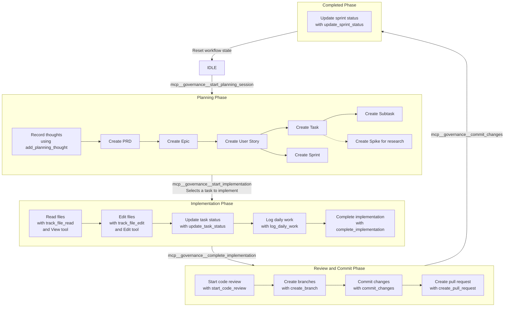

# Claude Code Integration

This document explains how to integrate Claude Code with the Software Planning Tool.

## Overview

Claude Code will interact with the software planning tool through the MCP Governance Server, which enforces a structured workflow for software development tasks. The governance server controls the transition between different phases of development and ensures tools are used in the appropriate order.

## Setup Instructions

1. Install the Software Planning Tool and its dependencies:
   ```bash
   pnpm install
   ```

2. Run the governance server:
   ```bash
   pnpm run governance
   ```

3. Configure Claude Code to use the governance MCP by:
   - Running Claude Code with the `--mcp` flag pointing to the running governance server
   - Updating your `CLAUDE.md` file to specify that specific tools must be used

## Claude.md Configuration

Add the following to your `CLAUDE.md` file to force Claude to use the governance tools:

```markdown
## Governance Workflow

Claude must follow the structured workflow enforced by the governance server. 
This means using specific tools at each stage of development:

1. **Planning Phase:**
   - Use `mcp__governance__start_planning_session` to begin a planning session
   - Use `mcp__governance__add_planning_thought` to record thoughts during planning
   - Use `mcp__governance__create_prd`, `mcp__governance__create_epic`, etc. to create documentation
   - Use `mcp__governance__create_task` to define implementation tasks

2. **Implementation Phase:**
   - Use `mcp__governance__start_implementation` to begin implementing a task
   - When reading files, always call `mcp__governance__track_file_read` before using View
   - When modifying files, always call `mcp__governance__track_file_edit` before using Edit
   - Use `mcp__governance__update_task_status` to update task status
   - Use `mcp__governance__log_daily_work` to log progress
   - Use `mcp__governance__complete_implementation` when finished

3. **Review and Commit Phase:**
   - Use `mcp__governance__start_code_review` for code review
   - Use `mcp__governance__create_branch` to create git branches
   - Use `mcp__governance__commit_changes` to commit work
   - Use `mcp__governance__create_pull_request` to create PRs

4. **Completed Phase:**
   - Use `mcp__governance__update_sprint_status` to update sprint status

IMPORTANT: Claude must NEVER use standard file operations (View, Edit, etc.) without first calling the corresponding governance tracking tool.
```

## Available Tools

The governance server provides the following tools through the MCP protocol:

| Tool | Description | Phase |
|------|-------------|-------|
| `mcp__governance__start_planning_session` | Start a new planning session with a goal | IDLE |
| `mcp__governance__add_planning_thought` | Record a thought during planning | PLANNING |
| `mcp__governance__create_task` | Create a new implementation task | PLANNING |
| `mcp__governance__list_tasks` | List all tasks in the current plan | PLANNING, IMPLEMENTATION |
| `mcp__governance__start_implementation` | Start implementing a specific task | PLANNING, IMPLEMENTATION |
| `mcp__governance__track_file_read` | Track file read access | IMPLEMENTATION |
| `mcp__governance__track_file_edit` | Track file edit | IMPLEMENTATION |
| `mcp__governance__complete_implementation` | Mark current task as complete | IMPLEMENTATION |
| `mcp__governance__commit_changes` | Commit changes | REVIEW_AND_COMMIT |

## Workflow Enforcement

The governance server enforces the workflow phases shown in the diagram below:



Attempting to use tools out of sequence will result in error messages explaining the appropriate phase for that tool.