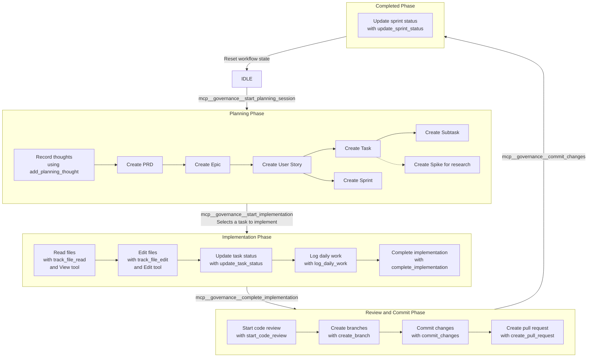

# Software Planning Tool Workflow

## Workflow Phases

## Workflow Description

1. **Planning Phase**: This is where the planning process begins, with activities such as recording thoughts, creating PRDs, epics, user stories, tasks, subtasks, spikes, and sprints.

2. **Implementation Phase**: In this phase, developers implement the planned tasks by reading and editing files, updating task status, logging daily work, and eventually completing the implementation.

3. **Review and Commit Phase**: Once implementation is complete, the code undergoes review, branches are created, changes are committed, and pull requests are submitted.

4. **Completed Phase**: The final phase where sprint status is updated, and the workflow can reset to start a new cycle.

The transitions between phases are governed by specific governance tool calls that enforce the proper workflow state transitions, ensuring a structured and consistent development process.